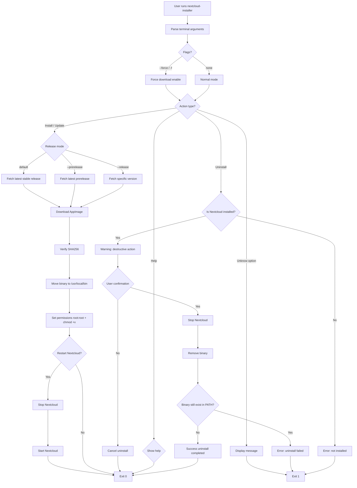

# Nextcloud Installer & Updater (Linux)

```text
 _   _            _       _                 _ 
| \ | |  _____  _| |_ ___| | ___  _   _  __| |
|  \| |/  _ \ \/  /__/ __| |/ _ \| | | |/ _` |
| |\  |   __/>  <| || (__| | (_) | |_| | (_| |
|_| \_|\\___/_/\_\__\____|_|\___/ \__,_|\__,_|

Linux Installer & Updater
```


A shell script to install, update, and manage the Nextcloud Desktop client on Linux systems.

It automatically download the latest (or specific) release from Github, installs it to `/usr/local/bin`, and handles updates safely.

---

## Features
- Install latest Nextcloud Desktop AppImage
- Update to specific or latest version
- Automatic version detection
- SHA256 checksum verification
- Clean uninstall option
- Colored terminal output
- Optional restart after update
- Supports prereleases

---

## Installation
1. Clone repository
```bash
git clone https://github.com/arthur10o/nextcloud-desktop-installer.git
cd [your-repo]
```
2. Make executable
```bash
chmod +x nextcloud-installer
```
> **Note**: The repository contains both `nextcloud-installer.sh`and `nextcloud-installer`.\
> They are indentica; the second version is simply provided without the `.sh` extension for users who prefer executable-style commands.
3. Then run

Using executable version:
```bash
bash nextcloud-installed.sh
```
Or using the `.sh` version:
```bash
./nextcloud-installer.sh
```
---

## Behavior
Installs Nextcloud binary to `/usr/local/bin/nextcloud`.

## Usage

| Option | Description |
|--------|------------|
| `-r, --release <version>` | Install specific version (e.g. 33.0.5) |
| `--prerelease` | Install latest prerelease |
| `-f, --force` | Force re-download even if up to date |
| `-u, --uninstall` | Remove Nextcloud from system |
| `-h, --help` | Show help |

## 🧠 System Flow

